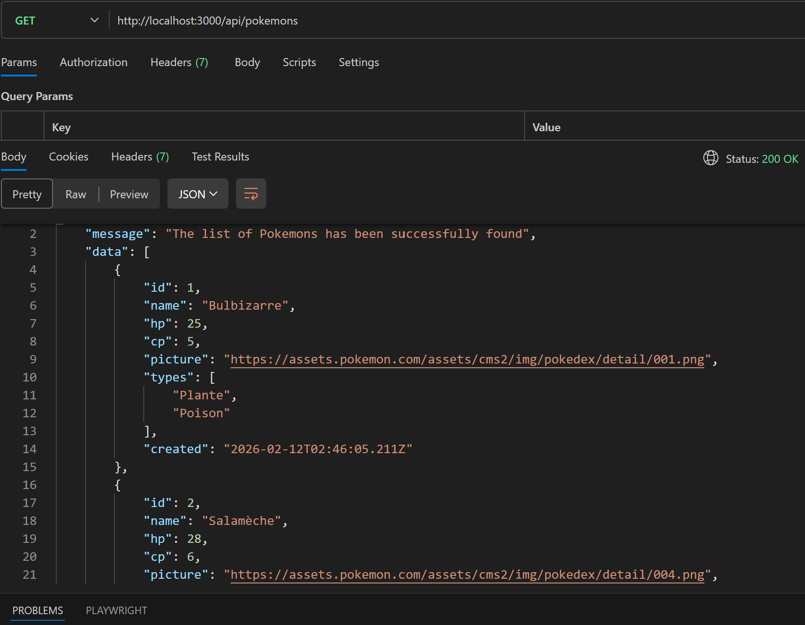
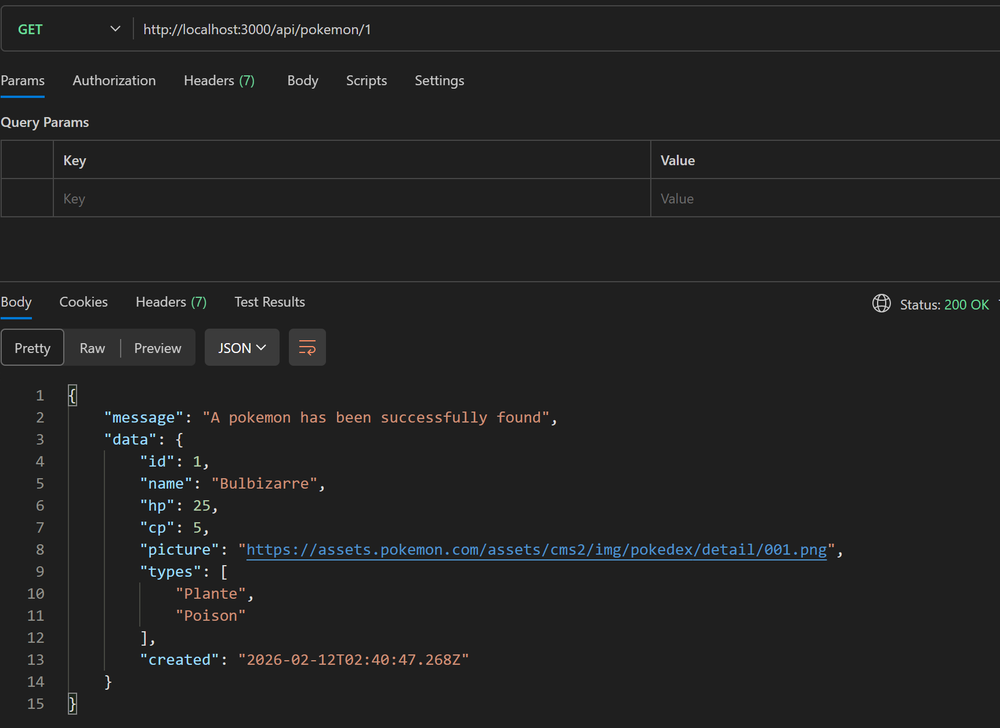
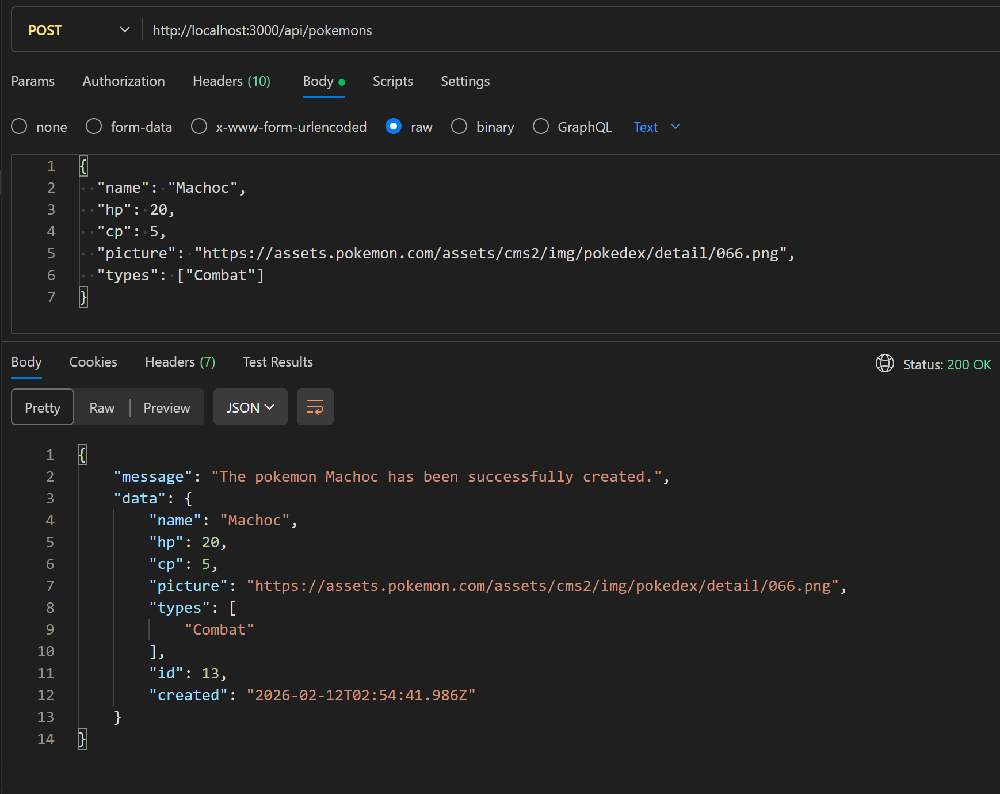
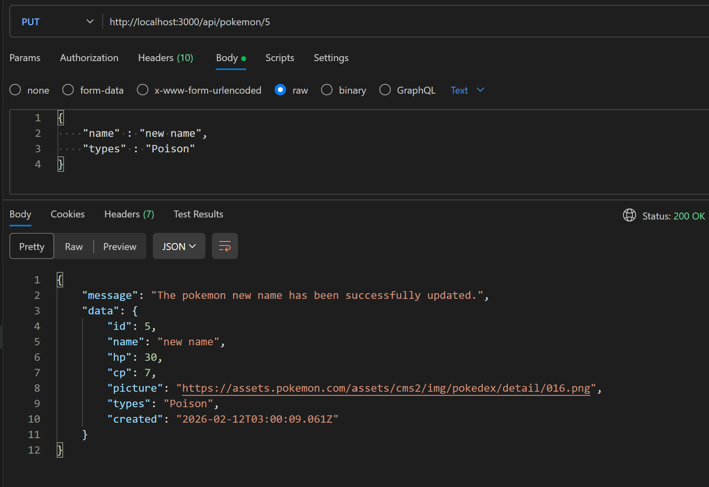
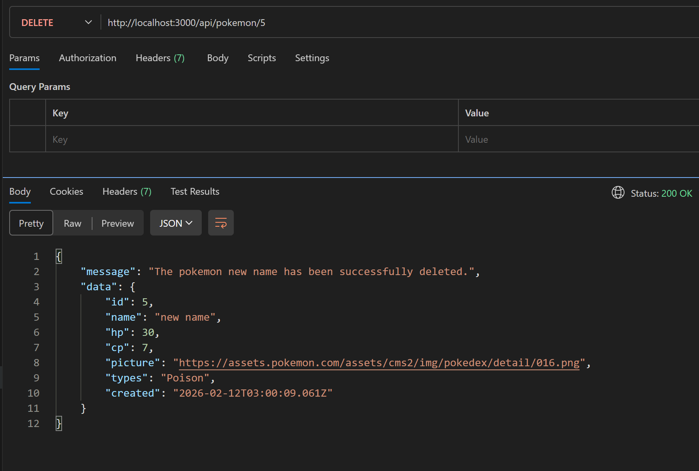

## RestAPI for system design and analysis course

### All CRUD operations added and tested with Postman

### GET all pokemons : http://localhost:3000/api/pokemons

### GET pokemon by ID : http://localhost:3000/api/pokemon/:id

### CREATE a pokemon : http://localhost:3000/api/pokemons

### UPDATE a pokemon : http://localhost:3000/api/pokemon/:id

### DELETE a pokemon : http://localhost:3000/api/pokemon/:id

